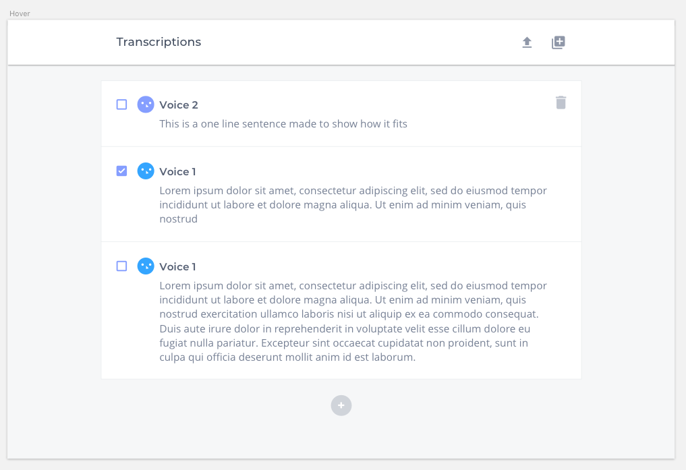
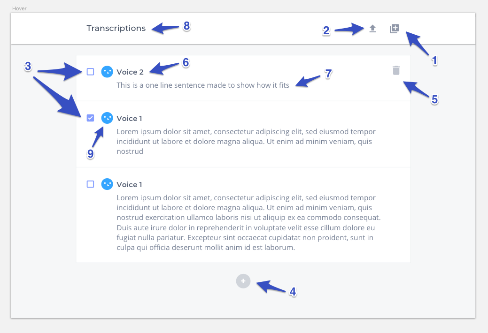

# Frontend Challenge

The goal is to understand how knowledgeable you are and how well you structure your app.

Your challenge will consist of the following:

You'll have to build a small web app that is able to **fetch data** from an endpoint we provide, **list the data** from the endpoint, allow **editing the data**, **adding and removing** rows, and then **pushing the data** to another endpoint.

Please fork this repo and commit your changes to the fork.

Here is a preview of what we are expecting:

Keep in mind that we may ask you about some of the decisions you made while building the app.

## Important information to complete the challenge

### Data source

Fetch the data from this endpoint [http://www.mocky.io/v2/5ae1c5792d00004d009d7e5c](http://www.mocky.io/v2/5ae1c5792d00004d009d7e5c)

Using Mocky should produce no cross origin errors and should work fine for this challenge. If you do find issues, it's OK to copy the JSON into your preferred method to then provide the data to the app.

### Assets, measurements, and other details

Inside this repository you'll find a folder named `assets-for-challenge`. Inside this folder you can find all the icons we expect you to use, in multiple formats, use what you think is best.

## Detailed comments on each element

**Functionality**

The app should let the user do the following:

- **1** - _Get data_ button. When the user **clicks on this button**, your app will **get the data from the URL** in [Data source](#Data source) and fill the list
- **2** - _Upload data_ button. When the user **clicks on this button**, your app will **make a POST request to the same url** as the _Get data_ button. You should send the latest information on the list using the same structure as you have received it.
- **3** - _Custom checkbox_. When the user **clicks on the checkbox**, it will become checked. It will not have any other functionality.
- **4** - _Add line_ button. When the user **clicks on this button**, a **new row will be added to the list** and the user should be able to **write text in both fields**.
- **5** - _Delete row_ button. This button should be **visible only when hovering** each row item. When the user **clicks on this button**, your app will **remove that row** from the list.
- **6** - List _item title_ **This title should be editable**.
- **7** - List _item content_. **This content should be editable**.
- **8** - _App title_. No functionality.
- **9** - _Person icon_ linked to each row. No functionality.

Notes:

- Don't worry about the blank state before loading the content.

**Style Attributes**

These are some and useful details about some of the elements

- **3** - The checkbox is 16px wide and 16px high. The purple color is `#859EFF`
- **6** - The font-family of the _item title_ is `Montserrat`, the weight is `SemiBold`, the size is `16px`, and the color is `#566074`
- **7** - The font-family of the _item content_ is `Open Sans`, the weight is `Regular`, the size is `16px`, and the color is `#778195`
- **8** - The font-family of the _app title_ is `Montserrat`, the weight is `Medium`, the size is `18px`, and the color is `#414C5E`

The data above is enough to complete challenge. We also include the source Sketch file in the repository, in case you want to check the original file. You can find it in `_README_assets/Challenge.sketch`

## Typography

- You can find [Montserrat on Google Fonts](https://fonts.google.com/specimen/Montserrat)
- You can find [Open Sans on Google Fonts](https://fonts.google.com/specimen/Open+Sans)

## Bonus points:

- Don't use a UI framework like Bootstrap. It's important for us to understand how you structure your HTML and build your CSS, that's why.
- Please use a javascript framework such as Vue (We love Vue), React, or Angular. Make use of its Component system.
